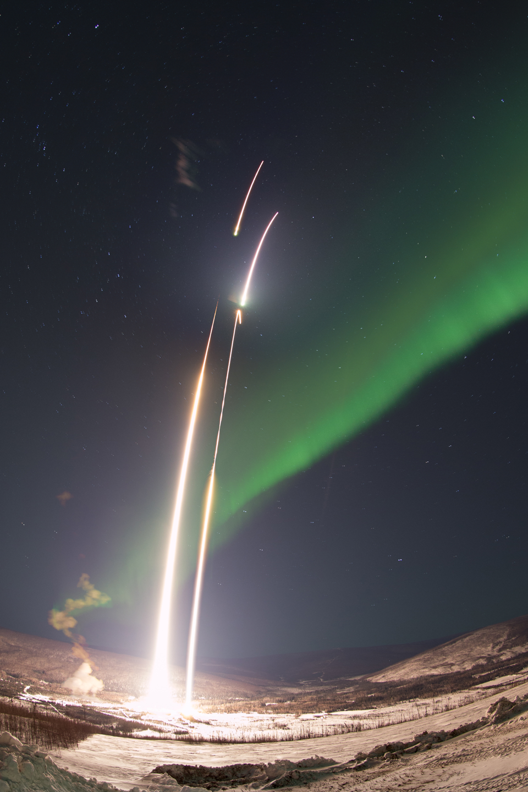

Two NASA sounding rockets were launched from the Poker Flat Research Range north of Fairbanks, Alaska on March 2, 2017 into a strong auroral arc.  The purpose of this rocket campaign was to study the driving conditions of neutral jets that flow in concert with auroral arcs.  The rockets and experiments performed very well and promises to advance the understanding of the coupling between the upper atmosphere and the aurora.

